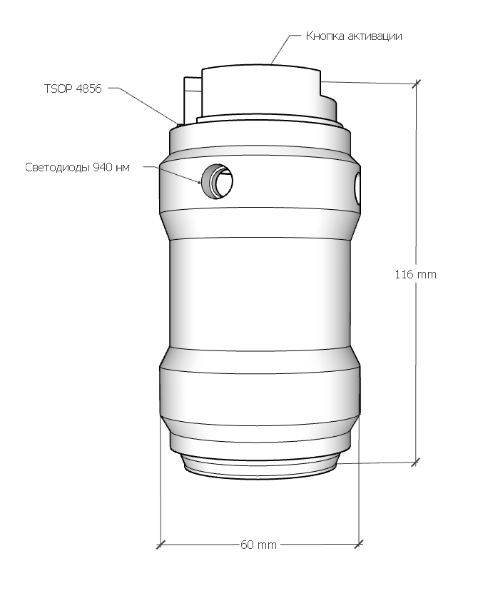

# Граната античит

## Электронные компоненты
* Плата DigiSpark 16 mHz 1 шт
* Светодиоды инфракрасные 4 шт, длина волны 940 нм
* Пьезо-зуммер на 3В 1 шт
* Резисторы на 0.45 ОМ 1 шт и на 100 ОМ 1 шт
* Кнопка замыкающая 1 шт
* Транзистор SS8050 D.331, 1 шт
* ИК-приемник TSOP 4856 1 шт
* Источник питания на 3.7В, ток 200 мА, либо батарейка 18650
* Выключатель
* Гнездо зарядки 5*2,5
* Зарядный кабель USB-A / 5*2.5

## Энергопотребление
* В покое 58 мА
* Инициализация, первые 5 секунд после старта: 170 мА
* В момент восстановления на аптечке 67 мА
* В момент взрыва 76 мА (из которых на светодиод приходится 18 мА)

## Зарядка аккумулятора
* Максимальный ток зарядки - 1А
* Максимальное напряжение зарядки - 5В
* Приблизительное время до полной зарядки - 3ч
* Граната оборудована платой защиты, которая отключает аккумулятор при напряжении на нем выше 4.2В, которое соответствует его 100% заряженности
* Минимально допустимое напряжение аккумулятора - 2.7В, соответствующее полной разряженности аккумулятора. Однако, для стабильной работы электроники и нормальной дальности поражения рекомендуется напряжение не ниже 3.7В

## Настраиваемые параметры в коде прошивки
* TONE_PIN - пин, к которому подключен плюс пьезо-зуммера
* BTN_PIN - пин, к которому подключена кнопка взрывателя
* RESET_PIN - пин, к которому подключен TSOP4856
* IR_PIN - пин, к которому подключен ИК-светодиод
* BANGS_COUNT - количество последовательных взрывов с интервалом в 200 мс
* BEFORE_BANG_DELAY - количество секунд между нажатием кнопки и взрывом
* RESPAWN_CMD - код команды от аптечки, которая восстанавливает гранату
* BANG_CMD - код взрыва
* SETTINGS_WAIT_TIME - время с момента включения в милисекундах, которое граната ожидает нажатия кнопки для перехода в режим настроек

## Режимы работы
**1. Восстановление по аптечке** - Граната восстанавливается при попадании на TSOP команды `RESPAWN_CMD`. В меню настроек этот режим обозначается одним длинным писком без коротких

**2. Восстановление по времени** - Граната восстанавливается автоматически по прошествии некоторого времени после взрыва. Режим обозначается одним длинным писком и после него одним или несколькими короткими. Количество коротких писков соответствует количеству минут. Минимальное значение - 1 минута, максимальное - 4 минуты

**Вход в режим настроек** осуществляется нажатием и удерживанием кнопки активации в первые 5 секунд после включения гранаты. Успешный вход в режим настроек обозначается тремя короткими писками, после которых кнопку можно отпускать.

**Выбор режима работы** осуществляется в режиме настройки коротким (менее 1 секунды) нажатием кнопки активации. Выбранный режим работы обозначается, как это указано выше в данном разделе.

**Сохранение выбранного режима** осуществляется в режиме настройки длинным нажатием на кнопку активации (более 1 секунды). Успешное сохранение выбранного режима обозначается 4 короткими писками.

## Античит функции

* Граната не восстанавливается после включения или выключения питания, поскольку факт ее использования хранится в энергонезависимой памяти
* После включения и выключения настройки режимов сохраняются, перенастройка не требуется
* В случае, если граната была использована в режиме с автоматической активацией по времени, а затем выключена до истечения этого времени, то при включении время начнется заново. Например, если выставлен режим восстановления через 60 секунд, произошел взрыв, через 30 секунд мы выключили и включили гранату, то восстановление произойдет только через 60 секунд после включения. Таким образом, включение/выключение устройства только прибавляет время на восстановление

## Известные побочные эффекты
* После включения происходит инициализация гранаты в течение 5 секунд, когда не работает кнопка и не происходит восстановление. Это особенность платы DigiSpark, на которую прошивка повлиять не может

## Условия эксплуатации

* Граната не является водонепроницаемой. Уязвимые места: посадочные места светодиодов, отверстие пьезо-динамика, гнездо зарядки. Игра в небольшой дождь допустима, но не желательна. Погружение в воду даже на короткое время выведет устройство из строя
* Корпус изготавливается из PLA пластика с заполнением не менее 40%. Выдерживает падение на бетон, дерево, землю при броске без усилий с высоты до 5 метров. Не выдерживает прыжок взрослого человека ногами на корпус, удары молотком. Для повышения ударопрочности рекомендуется проклеить резиной места возможного соприкосновения с поверхностью
* Максимальная эффективность работы достигнута в темных помещениях. В освещенных помещениях за счет отражения ИК света от стен зона поражения - вся комната. Тестирование проводилось в комнате площадью 20 кв. м
* Минимальная эффективность - на улице днем. Зона поражения до 3 метров при прямой видимости без помех в виде травы или деревьев